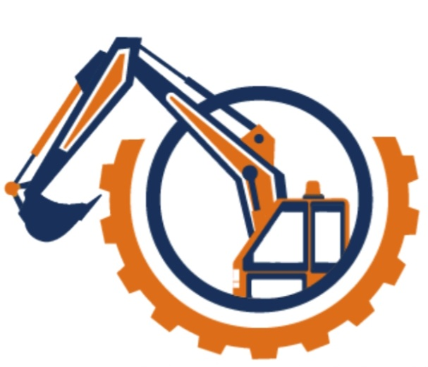
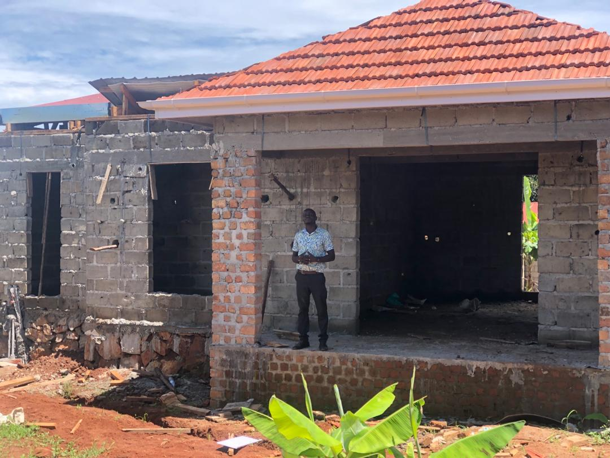
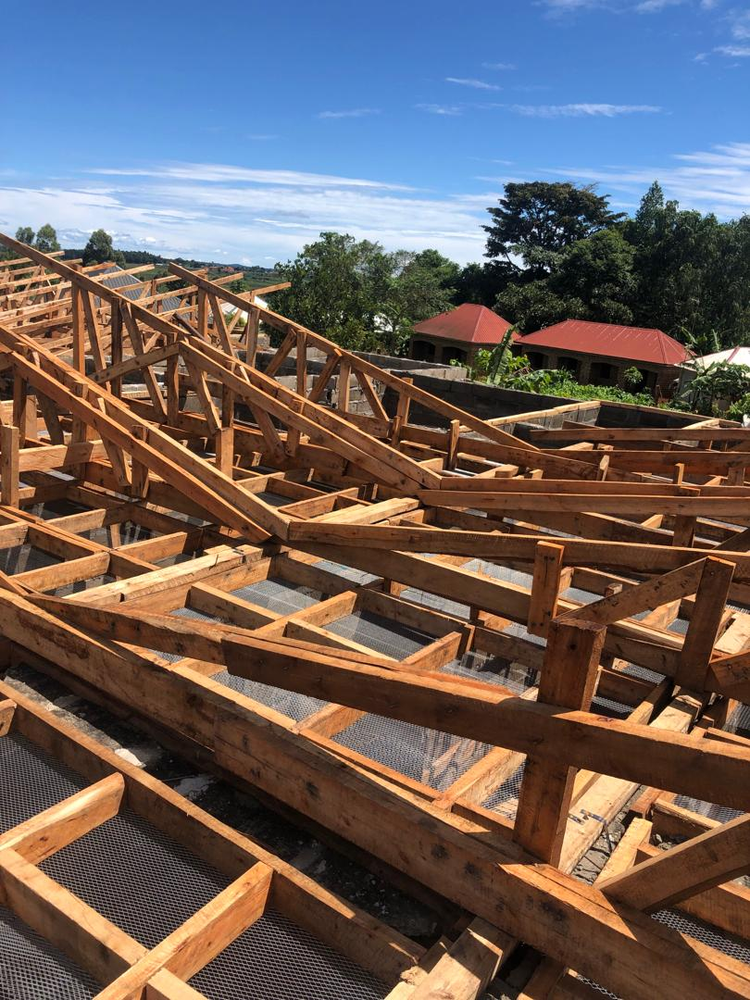
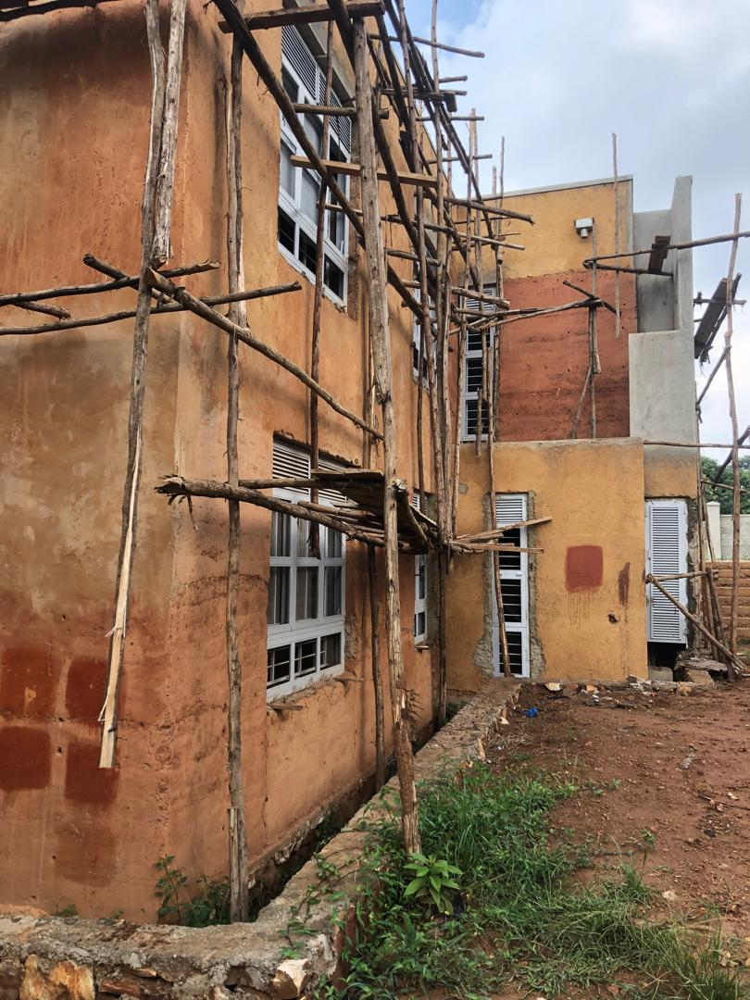
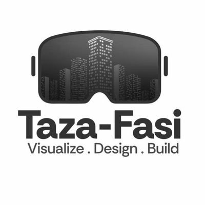
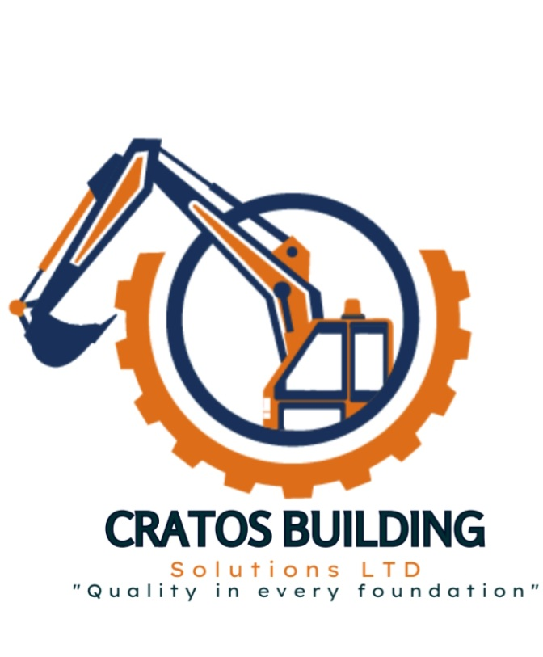

<!DOCTYPE html>
<html lang="en">
<head>
    <meta charset="UTF-8">
    <title>CratosBuilding Construction solutions</title>
    <meta name="viewport" content="width=device-width, initial-scale=1.0">
    <link href="https://cdn.jsdelivr.net/npm/bootstrap-icons/font/bootstrap-icons.css" rel="stylesheet">
    
</head>
<body>
    <nav>
        
        <h2>CRATOS BUILDING SOLUTIONS</h2>
        <i class="bi bi-list"></i>
    </nav>
    

        <h1 style="margin-top:0px;padding:100px 50px;" id="h1">"Quality In Every Foundation"
        <button class="btn0">Learn More 》</button></h1>
        <button class="btn1">
            <h1>PROJECTS</h1>
            
0

        </button>
        <button class="btn1">
            <h1>CLIENTS</h1>
            
0

        </button>
   
    

    

        <h1>About us</h1>
 

  <!-- Accordion Items -->
  

    

      MISSION
      +
    

    

        <h2>OUR MISSION</h2>
       
"To provide innovative, sustainable, and high-quality construction and design services, including building constructions, architectural design, structure drawings, M&E drawings, and valuation and cost estimates. We aim to exceed client expectations through our dedication to excellence, integrity, and collaborative teamwork."

    

  

  

    

      VISION
      +
    

    

        <h2>OUR VISION</h2>
      
"To be the leading construction and design firm renowned for transforming client dreams into reality, fostering sustainable development, and contributing to the growth and enhancement of our communities."

    

  

  

    

      GOALS
      +
    

    

        <h2>OUR GOALS</h2>
         <ol>
            <li><b>Client Satisfaction.</b> Ensure every project meets or exceeds client expectations in quality, timelines and budget.</li>
            <li><b>Innovation and Excellence.</b> Continuously integrate modern technologies and creative solutions to deliver superior architectural designs and construction services.</li>
            <li><b>Sustainability. </b>Promote environmentally friendly practices and materials in all phases of construction and design.</li>
            <li><b>Professional Development.</b> Invest in the growth and development of our team to stay at the fore-front of industry standards and best practices. </li>
            <li><b>Operational Efficiency.</b> Streamline project management processes to optimize resources and deliver value-driven outcomes.</li>
            <li><b>Community Impact.</b> Contribute positively to local communities by creating durable, functional and aesthetically pleasing structures that enrich lives.</li>
            <li><b>Ethical Practices.</b> Uphold transparency, integrity and accountability in every aspect of business operations.</li>
        </ol>
    

  

  

    

      TEAM
      +
    

    

      <h2>OUR TEAM</h2>
        
        <ul>
            <h5>MANAGING DIRECTOR</h5>
            <li>MR. Gerald Kabali</li>
            <li>masembeg4@gmail.com</li>
        </ul>
        

        
        <ul>
            <h5>GENERAL OPERATIONAL MANAGER</h5>
            <li>MR. Tomusangye Moses</li>
            <li>tomusangemze45@gmail.com</li>
        </ul>
        

        
        <ul>
            <h5>CHIEF FINANCIAL OFFICER</h5>
            <li>MR. Joel Nkwanga</li>
            <li>joelnkwanga@gmail.com</li>
        </ul>
    

  

<!-- Fullscreen Modal -->

  <button class="cancel">&times;</button>
  

    <!-- Dynamic content will be inserted here -->
  

 
     <section id="services" class="services-parallax-section">
    

    

        <h2>Our Services</h2>
        
Explore our specialized services designed to exceed your expectations.

        

            

                <i class="icon fa fa-building"></i>
                <h3>Building Constructions</h3>
                
Professional construction solutions for your projects.

            

            

                <i class="icon fa fa-drafting-compass"></i>
                <h3>Architectural Designs</h3>
                
Creative designs that bring your vision to life.

            

            

                <i class="icon fa fa-ruler-combined"></i>
                <h3>Structure Drawings</h3>
                
Accurate and precise structural plans.

            

            

                <i class="icon fa fa-cogs"></i>
                <h3>M&E Drawings</h3>
                
Mechanical and electrical engineering blueprints.

            

            

                <i class="icon fa fa-calculator"></i>
                <h3>Valuation & Cost Estimates</h3>
                
Detailed cost assessments for informed decisions.

            

        

    

</section>

    

        <h1>Project FortPolio</h1>
          

                 

      
    

    

      
    

    

      
    

    

      
    

    

      
    

          

    

    <h2>Quote request</h2>
    <form>
  <label class="label">Name:</label>
  <input type="text" id="inpt" placeholder="Your name...">
  <label class="label">Email:</label>
  <input type="email" id="inpt" placeholder="Your e-mail...">
  <label class="label">Tel.</label>
  <input type="number" id="inpt" placeholder="123-4567-890...">
  <label class="label">Comment:</label>
  <textarea placeholder="Your comment..."></textarea>
  <button type="submit">Submit</button>
</form>
  <h4>Partnerships</h4>
  

    
  

    <footer>
        

            
            <h3 class="footer-heading">Contact Us</h3>
            

                

                    <ul class="footer-list">
                        <li class="list-heading">Managing Director</li>
                        <li>0789512738</li>
                        <li>0703346694</li>
                        <li><a href="mailto:masembeg4@gmail.com">masembeg4@gmail.com</a></li>
                    </ul>
                

                

                    <ul class="footer-list">
                        <li class="list-heading">General Operations Manager</li>
                        <li>0774367213</li>
                        <li><a href="mailto:tomusangemze45@gmail.com">tomusangemze45@gmail.com</a></li>
                    </ul>
                

                

                    <ul class="footer-list">
                        <li class="list-heading">Chief Financial Officer</li>
                        <li>0706143116</li>
                        <li>0783317981</li>
                        <li><a href="mailto:joelnkwanga@gmail.com">joelnkwanga@gmail.com</a></li>
                    </ul>
                

            

        

    </footer>

</body>
</html>
